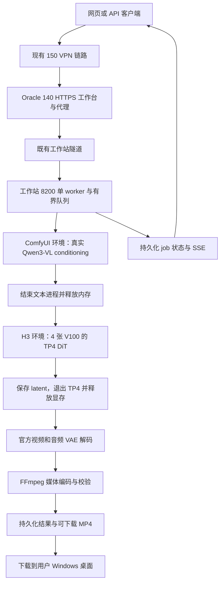

# MiniMax H3 接手记录

更新日期：2026-09-24。此文件保存本项目的工作位置、证据边界和下一步，避免新会话把中间结果误当作成品。本轮已完成真实端到端媒体和公网 API 验收。

## 目标

在本地 `ymzx` 工作站上让四张 V100-SXM2-16GB 共同运行 MiniMax H3，完成真实文字生成有声视频；将真实 MP4 下载到 Windows 桌面，并让 `https://140.245.81.67/` 能看到实际就绪的 H3 服务。服务需支持网页/API、持久化历史、刷新恢复、同步后端的进度和有界请求队列。

源码及经验固定保存到 `D:\minimax-h3-4gpu`。用户已授权继续研发、实测、调优与部署，不需重复询问是否继续。

## 当前结论和证据等级

| 项目 | 当前能确认的结论 | 证据/限制 |
|---|---|---|
| 四卡硬件/NCCL | 历史实机通过；V100 之间 NV2、P2P OK | `docs/hardware-2026-09-23.md`；不是本轮实时状态 |
| TP4 DiT，864×480、124 帧、20 次评估 | 历史 DiT-only 通过，latent finite | `reports/remote-h3-tp4-gate.json`、`remote-h3-tp4-safe-nofinite.json`；conditioning 为随机夹具 |
| TP4 DiT，1152×640、124 帧、20 次评估 | 历史 FF 分块实验通过 | `reports/remote-h3-tp4-640x1152-chunked8192.json`；仍不是最终画质验收 |
| 真实文本 conditioning | 已通过 | 手动任务 `manual-real-20260924-final2` 和公网 API 任务均写出 bundle |
| TP4 DiT，真实 prompt | 已通过 | `reports/remote-h3-e2e-20260924-manual.json`；ComfyUI PyTorch 2.10.0+cu128，20 步约 119.9 秒，四卡峰值 allocated 约 12.49 GiB/卡，latent finite |
| 官方视频/音频 VAE 与 MP4 | 已通过 | 手动任务生成 864×480、124 帧、5.1667 秒 MP4；解码日志在远端任务目录，媒体报告已回收 |
| 真实 prompt 的端到端 MP4 | 已通过两次 | 手动和公网 API 各一条；桌面文件见下文，API 任务 `518dda3d36894eee7bdd4c0e` |
| WebUI/API | 已部署并通过 | 工作站 `8200` 单 worker、持久化队列、真实进度；公网 POST→采样→VAE→MP4 返回 202/完成和下载 URL |
| Oracle HTTPS 就绪 | 已通过 | `/router-health/h3`、`/h3-api/health` 返回 200；140 nginx ACL 与既有反向隧道保持不变 |
| 桌面交付 | 已通过 | `C:\Users\Administrator\Desktop\minimax-h3-real-20260924-final2.mp4` 与 `minimax-h3-api-518dda3d36894eee7bdd4c0e.mp4`，均已 ffprobe |

`reports/stage-summary-final.json` 明确标记历史数据 `has_vae_stage=false`、`has_output_stage=false`。其中 `step_count=80` 是四个 rank 的步骤记录汇总，模型实际评估次数仍是 20，不是 80。

## 路径与拓扑

| 用途 | 位置 |
|---|---|
| Windows 主项目 | `D:\minimax-h3-4gpu` |
| GPU 工作站 | `192.168.1.140`，用户 `ymzx` |
| 工作站项目 | `/home/ymzx/minimax-h3-4gpu` |
| TP4 环境 | `/home/ymzx/h3-venv` |
| ComfyUI/文本编码环境 | `/home/ymzx/ComfyUI/venv` |
| LightX2V 下游 | `/home/ymzx/LightX2V-V100` |
| H3 模型根目录 | `/home/ymzx/models/minimax-h3` |
| pruned Transformer | `/home/ymzx/models/minimax-h3/lightx2v-fl2v-pruned` |
| 文本编码器 | `/home/ymzx/ComfyUI/models/text_encoders/qwen3vl_32b_minimax_h3_int8_convrot.safetensors` |
| 视频 VAE 默认位置 | `/home/ymzx/models/minimax-h3/FL2VA/FL2VA/video_vae/source/model.safetensors` |
| 音频 VAE 默认位置 | `/home/ymzx/models/minimax-h3/FL2VA/FL2VA/audio_vae/model.safetensors` |
| 当前手动实测目录 | `/home/ymzx/minimax-h3-4gpu/h3-jobs/manual-real-20260924-final2` |
| 本轮 TP4 日志 | `/tmp/tp4-real-comfy.log`；公网 API worker 的任务目录保留阶段 JSONL 和 benchmark |
| 网关默认监听 | 工作站 `127.0.0.1:8200` |
| 统一 HTTPS 入口 | Oracle 140 `https://140.245.81.67/` |
| H3 页面/API | `/minimax-h3/`、`/h3-api` |
| 根页面 H3 探测路径 | `/router-health/h3`，代理是否正确待复核 |

Oracle 140 使用 `oracle161` SSH 配置和 `ubuntu` 用户；凭据只从授权配置读取。Oracle 150 是现有 VPN/出口，不运行本项目 GPU 推理。继续使用既有访问限制，不为解决健康检查随意扩大公网暴露范围。



## 运行环境修复和本轮验收

1. 原文本编码器损坏，已从 ModelScope 重新并行下载。交接记录的 SHA256 是 `bc2ced0fbea64757fa9acddccfc0b3f4819d1dcf1da6c124d690d368be283923`。这是文件完整性记录，不是秘密；后续下载不能仅以 HTTP 200 或文件名判断成功。
2. 上述手动任务目录已有 `request.json`、真实 `conditioning.safetensors` 和 `effective-config.json`。
3. `generate_video.py` 已回收到本机并固定 safetensors 实际长度校验、ComfyUI 绝对解释器做文本编码/解码，以及优先使用支持 SM70 的 ComfyUI `torchrun`；本机和工作站文件已同步。
4. 已补 `gguf`；ComfyUI 的 cu128 torchvision 与 H3 的 cu130 PyTorch 不兼容，交接称已备份并放入纯 Python torchvision 兼容层。此项属于环境兼容补救，必须记录实际文件、备份路径和 import 检查，不要未经核对复制到其他环境。
5. `h3-venv` 曾因缺少 `prometheus_client`、`pydantic` 及其依赖无法导入；现已补齐并保留。实际 TP4 不能使用该环境的 PyTorch 2.14.0+cu130（不含 `sm_70`），已验证使用 `/home/ymzx/ComfyUI/venv` 的 PyTorch 2.10.0+cu128（包含 `sm_70`）运行四卡 TP4。服务通过 `H3_PIPELINE_PYTHON`、`H3_TORCHRUN` 固定该解释器，避免以后命中错误环境。

6. 本轮手动端到端任务：真实中文 prompt、864×480、124 帧、20 步；TP4 DiT pipeline 约 119.92 秒，VAE/编码完成后得到 `h3-preview.mp4`。公网 API 任务 ID 为 `518dda3d36894eee7bdd4c0e`，状态从 conditioning、loading、sampling、decode、encode 到 completed，返回 2,368,687 字节 MP4。

本轮开始时本机 `scripts/generate_video.py` 仍采用硬编码文件最小长度、文本编码的 `sys.executable` 和裸 `torchrun`；该同步差异已经回收并修复，当前代码优先选择支持 SM70 的 ComfyUI `torchrun`。

## 后续工作

1. 保持 `minimax-h3.service` 运行并观察队列、失败重试和重启恢复；当前单 worker 是安全并发上限。
2. 对高分辨率 640×1152 和 30 步做端到端质量/内存回归；历史仅有 DiT-only 证据，不能直接宣称 VAE 成品通过。
3. 若需提速，优先研究常驻 TP4 模型和文本 conditioning 缓存；每次改动都要重新记录四卡峰值、端到端耗时和媒体可解码性。
4. 补充浏览器刷新中的 SSE/轮询体验测试，以及 Range 下载和历史结果展示；不要把前端动画当作模型进度。

可先做不启 GPU 的资源检查；它只检查资源，不代表完成视频验收：

```bash
/home/ymzx/ComfyUI/venv/bin/python \
  /home/ymzx/minimax-h3-4gpu/scripts/generate_video.py --check
```

当前已验证的持久化服务由 systemd 管理（工作站 `/etc/systemd/system/minimax-h3.service`）：

```bash
systemctl status minimax-h3.service
curl -fsS http://127.0.0.1:8200/health
```

## WebUI/API 的已有行为和验收边界

- 任务数据默认写入 `h3-jobs/<job_id>/`。服务重启会将正在运行的任务标记 `interrupted`，并恢复排队任务；这不是从中间采样步继续生成。
- 浏览器持久化 job id，再通过查询和 SSE 恢复显示；服务端 `job.json` 才是任务状态来源。
- 本轮公网 API 任务已在服务重启后再次查询到 `completed`，证明历史任务不会因网关进程重启丢失；SSE 完成事件和 Range `206` 文件下载也已实测。
- SSE 空闲心跳约每秒一次。真实采样百分比只能随后端完成的 step 更新；每步 6–15 秒时不能伪造每秒完成一个 step。每秒刷新用时/连接状态与真实模型进度应区分。
- 参数校验当前允许横竖两个尺寸档、124 帧、20/30 次评估；历史实测只覆盖表中横向几何和 20 次评估。API 可接收不等于该档位已通过质量验收。
- `--check` 主要检查文件；缺依赖、GPU 不可用、NCCL 错误和媒体失败仍可能发生。健康检查需结合真实验收和 worker 状态，不应修改为永远返回 ready。
- `service.py`/`jobs.py` 的单 worker 持续运行，但当前 `generate_video.py` 每请求启动新的 TP4 子进程；“TP4 模型常驻复用”仍是优化方向，尚未实现。

## 已知文档差异

- 旧的研究/瓶颈段落可能保留早期“尚无 VAE”的历史措辞；当前状态以本文件、`docs/EXPERIMENTS.md` 和 `reports/remote-h3-e2e-20260924-api.json` 为准。
- `docs/runbook.md` 的历史 benchmark 命令使用 ComfyUI `torchrun`；新 H3 环境调试应核对绝对路径，不能盲目复制旧命令。
- `docs/research.md` 和历史报告的 cu128 属于旧环境；上轮交接的 H3 cu130 必须独立核验 SM70 支持、依赖 ABI 和真实性能。
- 公开上游 pin 与历史 benchmark 的 `source_revision` 不一定相同；性能复现要保存实际下游 commit 和本地 patch，而不只写上游项目名。
- 端到端代码、网关、网页和本轮报告已提交并推送到公开仓库；同步远端时仍须保留本文件记录的 systemd 环境选择。

## 后续调优优先级

先通过真实端到端，再分别测文本编码、冷启动/权重加载、DiT、VAE、编码、队列等待。历史纯 DiT 热态约 120 秒不能当作用户总等待时间。

高并发先解决排队、取消、失败隔离、重启恢复和最大等待时长；同一 TP4 组同时跑多个完整生成会争夺显存及 NCCL。高分辨率从已测 FF 分块档开始，固定 seed 对比最终画质。以四卡每阶段利用率、峰值显存、CPU RAM 和端到端时延定位瓶颈，而不是只看某一瞬间的 100% GPU 利用率。
